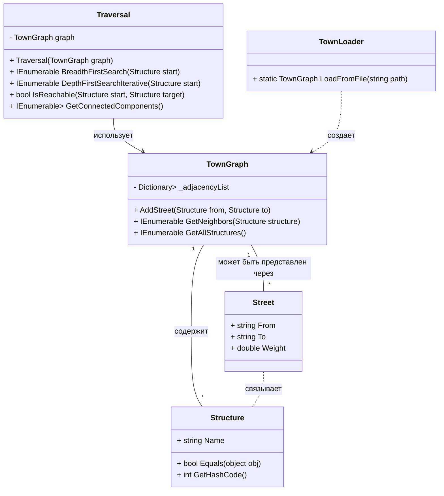

# HistoryTown: Учебный Проект по Алгоритмам на Графах (ЛР 4-6)


## Описание проекта

Данный проект разработан в рамках лабораторных работ №4-6 по дисциплине "Алгоритмизация и программирование" для студентов направления "Искусственный интеллект". Цель проекта - освоить представление данных в виде графа и реализовать основные алгоритмы на графах, применяя их к предметной области "Карта исторического города" (Вариант №12).

Проект реализует следующие этапы:
- **ЛР №4:** Построение графа, алгоритмы обхода (BFS, DFS), проверка достижимости, поиск компонент связности.
- **ЛР №5:** Взвешенный граф, алгоритм Дейкстры для поиска кратчайшего пути.
- **ЛР №6:** Дополнительный анализ графа (точки сочленения, минимальное остовное дерево).

## Технологии

*   **Язык программирования:** C# 13
*   **Платформа:** .NET 10.0
*   **Пользовательский интерфейс:** WPF (Windows Presentation Foundation)
*   **Тестирование:** xUnit
*   **CI/CD:** GitHub Actions

## Архитектура проекта

Проект следует принципам **Domain-Driven Design (DDD)**, разделяя логику на следующие слои:

*   **HistoryTown.Core (Domain Layer):** Содержит бизнес-логику и доменные объекты, не зависящие от технологий UI или хранения данных.
    *   `Entities/`: Определение сущностей предметной области (например, `Structure`, `Street`).
    *   `Collections/`: Структуры данных (например, `TownGraph`).
    *   `Algorithms/`: Реализации алгоритмов на графах (BFS, DFS, Дейкстра и др.).
    *   `Infrastructure/`: Вспомогательные классы для работы с внешними ресурсами (например, `TownLoader` для загрузки данных из файла).
*   **HistoryTown.WPF (Presentation Layer):** Реализует пользовательский интерфейс с использованием WPF, взаимодействуя с Core-слоем для выполнения операций.
*   **HistoryTown.Core.Tests (Test Layer):** Содержит модульные тесты для проверки корректности доменной логики и алгоритмов.

### Структура проекта (Mermaid-схема)

```mermaid
graph TD
    A[HistoryTown.slnx] --> B[source/]
    A --> C[tests/]
    A --> D[city_map.csv]
    A --> E[.github/workflows/build.yml]

    B --> B1[HistoryTown.Core/]
    B --> B2[HistoryTown.WPF/]

    B1 --> B1.1[Entities/]
    B1 --> B1.2[Collections/]
    B1 --> B1.3[Algorithms/]
    B1 --> B1.4[Infrastructure/]

    B2 --> B2.1[MainWindow.xaml]
    B2 --> B2.2[MainWindow.xaml.cs]
    B2 --> B2.3[city_map.csv]

    C --> C1[HistoryTown.Core.Tests/]
    C1 --> C1.1[Collections/TownGraphTests.cs]
    C1 --> C1.2[Algorithms/TraversalTests.cs]

    B1.1 --> E1[Structure.cs]
    B1.2 --> E2[TownGraph.cs]
    B1.3 --> E3[Traversal.cs]
    B1.4 --> E4[TownLoader.cs]

    B2.3 --&gt; E4
```

### UML-диаграмма классов



### UML-диаграмма классов

```mermaid
classDiagram
    class Structure {
        + string Name
        + bool Equals(object obj)
        + int GetHashCode()
    }

    class Street {
        + string From
        + string To
        + double Weight
    }

    class TownGraph {
        - Dictionary<Structure, List<(Structure Neighbor, double Weight)>> _adjacencyList
        + AddStreet(Structure from, Structure to, double weight)
        + IEnumerable<(Structure Neighbor, double Weight)> GetWeightedNeighbors(Structure structure)
        + IEnumerable<Structure> GetNeighbors(Structure structure) 
        + IEnumerable<Structure> GetAllStructures()
    }

    class Traversal {
        - TownGraph graph
        + Traversal(TownGraph graph)
        + IEnumerable<Structure> BreadthFirstSearch(Structure start)
        + IEnumerable<Structure> DepthFirstSearchIterative(Structure start)
        + bool IsReachable(Structure start, Structure target)
        + IEnumerable<List<Structure>> GetConnectedComponents()
    }

    class DijkstraAlgorithm {
        - TownGraph graph
        + DijkstraAlgorithm(TownGraph graph)
        + (Dictionary<Structure, double> distances, Dictionary<Structure, Structure?> previousNodes) FindShortestPaths(Structure start)
        + List<Structure> ReconstructPath(Structure start, Structure target, Dictionary<Structure, Structure?> previousNodes)
    }

    class TownLoader {
        + static TownGraph LoadFromFile(string path)
    }

    TownGraph "1" -- "*" Structure : содержит
    TownGraph "1" -- "*" Street : содержит через список смежности
    Traversal --> TownGraph : использует
    DijkstraAlgorithm --> TownGraph : использует
    TownLoader ..> TownGraph : создает
```

## Сборка и развертывание

Для сборки и запуска проекта вам потребуется установленный [.NET SDK 10.0](https://dotnet.microsoft.com/download/dotnet/10.0).

### Сборка проекта

Откройте командную строку (или PowerShell) в корневой директории проекта и выполните:

```bash
dotnet restore HistoryTown.slnx
dotnet build HistoryTown.slnx
```

### Запуск приложения

После успешной сборки, исполняемый файл приложения будет находиться в директории `source/HistoryTown.WPF/bin/Debug/net10.0-windows/`. Вы можете запустить его напрямую, либо использовать команду:

```bash
dotnet run --project source/HistoryTown.WPF/HistoryTown.WPF.csproj
```

### Запуск тестов

Для запуска модульных тестов выполните:

```bash
dotnet test HistoryTown.slnx
```

## Использование

1.  **Загрузка карты:** После запуска приложения нажмите кнопку "Загрузить карту города". Данные будут прочитаны из `city_map.csv` и загружены в граф.
2.  **Выбор зданий:** Выберите начальное и конечное здания из выпадающих списков.
3.  **Выполнение алгоритмов (ЛР №4):** Нажмите соответствующие кнопки для выполнения BFS, DFS, проверки достижимости или получения компонент связности. Результат будет отображен в текстовом поле справа.
4.  **ЛР №5 и ЛР №6:** Переключайтесь между вкладками для доступа к функционалу следующих лабораторных работ, который будет реализован в будущем.
