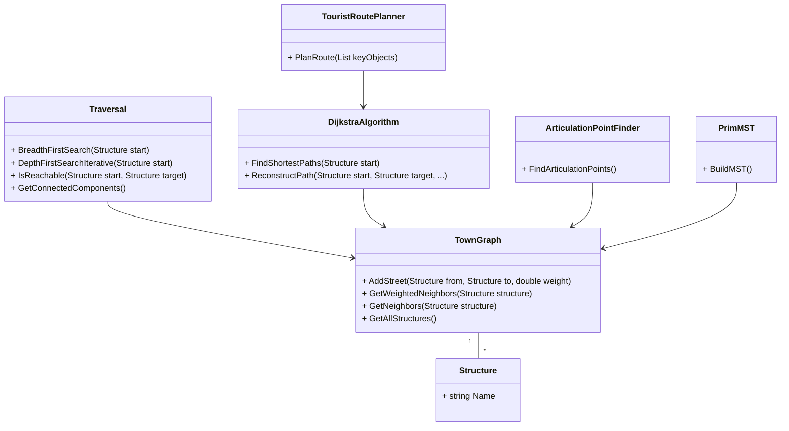

# HistoryTown: Учебный Проект по Алгоритмам на Графах (ЛР 4-6)

## Описание проекта

Данный проект разработан в рамках лабораторных работ №4-6 по дисциплине "Алгоритмизация и программирование" для студентов направления "Искусственный интеллект". Цель проекта - освоить представление данных в виде графа и реализовать основные алгоритмы на графах, применяя их к предметной области "Карта исторического города" (Вариант №12).

Проект реализует следующие этапы:
- **ЛР №4:** Построение графа, алгоритмы обхода (BFS, DFS), проверка достижимости, поиск компонент связности.
- **ЛР №5:** Взвешенный граф, алгоритм Дейкстры для поиска кратчайшего пути.
- **ЛР №6:** Дополнительный анализ графа (точки сочленения, минимальное остовное дерево, туристический маршрут).
- **Итоговый проект:** Интеграция всех модулей, замеры времени выполнения и сравнительный анализ алгоритмов.

## Технологии

*   **Язык программирования:** C# 13
*   **Платформа:** .NET 10.0
*   **Пользовательский интерфейс:** WPF (Windows Presentation Foundation)
*   **Тестирование:** xUnit
*   **CI/CD:** GitHub Actions

## Архитектура проекта

Проект следует принципам **Domain-Driven Design (DDD)**, разделяя логику на следующие слои:

*   **HistoryTown.Core (Domain Layer):** Содержит бизнес-логику и доменные объекты, не зависящие от технологий UI или хранения данных.
    *   `Entities/`: Определение сущностей предметной области (например, `Structure`, `Street`).
    *   `Collections/`: Структуры данных (например, `TownGraph`).
    *   `Algorithms/`: Реализации алгоритмов на графах.
        *   `Traversal`: BFS, DFS, достижимость, компоненты связности.
        *   `DijkstraAlgorithm`: Кратчайшие пути.
        *   `ArticulationPointFinder`: Поиск критических узлов города.
        *   `PrimMST`: Минимальное остовное дерево инфраструктуры.
        *   `TouristRoutePlanner`: Планирование маршрутов через несколько точек (Задача варианта №12).
    *   `Infrastructure/`: Вспомогательные классы (загрузка данных).
*   **HistoryTown.WPF (Presentation Layer):** Реализует пользовательский интерфейс, замеры времени (`Stopwatch`) и визуализацию результатов.
*   **HistoryTown.Core.Tests (Test Layer):** Модульные тесты.

### Структура проекта UML-диаграммой

## Использование

1.  **Загрузка карты:** После запуска приложения нажмите кнопку "Загрузить карту города". Данные загружаются из `city_map.csv`.
2.  **ЛР №4 (Обходы):** Вкладка "Обходы" позволяет запускать BFS/DFS и проверять связность.
3.  **ЛР №5 (Дейкстра):** Вкладка "Дейкстра" находит кратчайшие пути и восстанавливает маршруты между зданиями.
4.  **ЛР №6 (Анализ):** Вкладка "Анализ" содержит:
    *   **Точки сочленения:** поиск критических объектов города.
    *   **MST:** расчет минимальной сети коммуникаций.
    *   **Туристический маршрут:** планирование пути через выбранные (через Ctrl) объекты.
5.  **Итоговый проект (Сравнение):** Вкладка "Сравнение" проводит эксперимент: находит путь между двумя зданиями с помощью BFS (минимальное число ребер) и Дейкстры (минимальный вес), замеряя время выполнения и сравнивая результаты.
