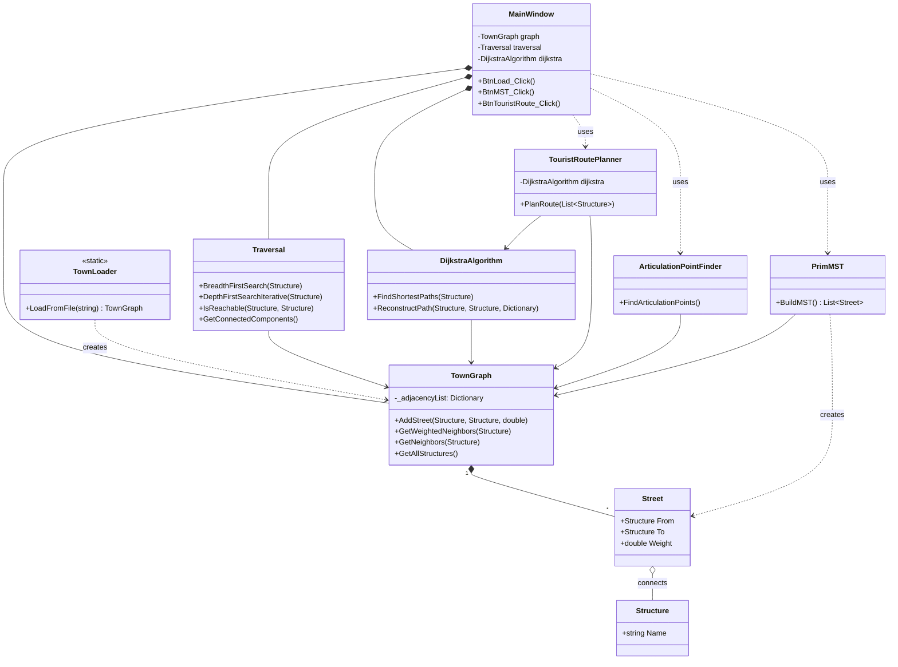

# HistoryTown: Учебный Проект по Алгоритмам на Графах (ЛР 4-6)


## Описание проекта

Данный проект разработан в рамках лабораторных работ №4-6 по дисциплине "Алгоритмизация и программирование" для студентов направления "Искусственный интеллект". Цель проекта - освоить представление данных в виде графа и реализовать основные алгоритмы на графах, применяя их к предметной области "Карта исторического города" (Вариант №12).

Проект реализует следующие этапы:
- **ЛР №4:** Построение графа, алгоритмы обхода (BFS, DFS), проверка достижимости, поиск компонент связности.
- **ЛР №5:** Взвешенный граф, алгоритм Дейкстры для поиска кратчайшего пути.
- **ЛР №6:** Дополнительный анализ графа (точки сочленения, минимальное остовное дерево, туристический маршрут).
- **Итоговый проект:** Интеграция всех модулей, замеры времени выполнения и сравнительный анализ алгоритмов.

## Технологии

*   **Язык программирования:** C# 14
*   **Платформа:** .NET 10.0
*   **Пользовательский интерфейс:** WPF (Windows Presentation Foundation)
*   **Тестирование:** xUnit, Coverlet (для покрытия кода)
*   **CI/CD:** GitHub Actions (автоматическая сборка, тестирование, генерация отчета по покрытию кода, создание релизов с исполняемым файлом и отчетом по покрытию)

## Архитектура проекта

Проект следует принципам **Domain-Driven Design (DDD)**, разделяя логику на следующие слои:

*   **HistoryTown.Core (Domain Layer):** Содержит бизнес-логику и доменные объекты, не зависящие от технологий UI или хранения данных.
    *   `Entities/`: Определение сущностей предметной области (например, `Structure`, `Street`).
    *   `Collections/`: Структуры данных (например, `TownGraph`).
    *   `Algorithms/`: Реализации алгоритмов на графах.
        *   `Traversal`: BFS, DFS, достижимость, компоненты связности.
        *   `DijkstraAlgorithm`: Кратчайшие пути.
        *   `ArticulationPointFinder`: Поиск критических узлов города.
        *   `PrimMST`: Минимальное остовное дерево инфраструктуры.
        *   `TouristRoutePlanner`: Планирование маршрутов через несколько точек (Задача варианта №12).
    *   `Infrastructure/`: Вспомогательные классы (загрузка данных).
*   **HistoryTown.WPF (Presentation Layer):** Реализует пользовательский интерфейс, замеры времени (`Stopwatch`) и визуализацию результатов.
*   **HistoryTown.Core.Tests (Test Layer):** Модульные тесты.

### Структура проекта UML-диаграммой


```mermaid
classDiagram
    class Structure {
        +string Name
    }

    class Street {
        +Structure From
        +Structure To
        +double Weight
    }

    class TownGraph {
        -_adjacencyList: Dictionary
        +AddStreet(Structure, Structure, double)
        +GetWeightedNeighbors(Structure)
        +GetNeighbors(Structure)
        +GetAllStructures()
    }

    class TownLoader {
        <<static>>
        +LoadFromFile(string) TownGraph
    }

    class MainWindow {
        -TownGraph graph
        -Traversal traversal
        -DijkstraAlgorithm dijkstra
        +BtnLoad_Click()
        +BtnMST_Click()
        +BtnTouristRoute_Click()
    }

    class Traversal {
        +BreadthFirstSearch(Structure)
        +DepthFirstSearchIterative(Structure)
        +IsReachable(Structure, Structure)
        +GetConnectedComponents()
    }

    class DijkstraAlgorithm {
        +FindShortestPaths(Structure)
        +ReconstructPath(Structure, Structure, Dictionary)
    }

    class TouristRoutePlanner {
        -DijkstraAlgorithm dijkstra
        +PlanRoute(List~Structure~)
    }

    class ArticulationPointFinder {
        +FindArticulationPoints()
    }

    class PrimMST {
        +BuildMST() List~Street~
    }

    %% Отношения
    MainWindow *-- TownGraph
    MainWindow *-- Traversal
    MainWindow *-- DijkstraAlgorithm
    MainWindow ..> TouristRoutePlanner : uses
    MainWindow ..> ArticulationPointFinder : uses
    MainWindow ..> PrimMST : uses

    TownGraph "1" *-- "*" Street
    Street o-- Structure : connects

    TownLoader ..> TownGraph : creates

    Traversal --> TownGraph
    DijkstraAlgorithm --> TownGraph
    TouristRoutePlanner --> DijkstraAlgorithm
    TouristRoutePlanner --> TownGraph
    ArticulationPointFinder --> TownGraph
    PrimMST --> TownGraph
    PrimMST ..> Street : creates
```

## Использование

1.  **Загрузка карты:** После запуска приложения нажмите кнопку "Загрузить карту города". Данные загружаются из `city_map.csv`.
2.  **ЛР №4 (Обходы):** Вкладка "Обходы" позволяет запускать BFS/DFS и проверять связность.
3.  **ЛР №5 (Дейкстра):** Вкладка "Дейкстра" находит кратчайшие пути и восстанавливает маршруты между зданиями.
4.  **ЛР №6 (Анализ):** Вкладка "Анализ" содержит:
    *   **Точки сочленения:** поиск критических объектов города.
    *   **MST:** расчет минимальной сети коммуникаций.
    *   **Туристический маршрут:** планирование пути через выбранные объекты.
5.  **Итоговый проект (Сравнение):** Вкладка "Сравнение" проводит эксперимент: находит путь между двумя зданиями с помощью BFS (минимальное число ребер) и Дейкстры (минимальный вес), замеряя время выполнения и сравнивая результаты.

## Развёртка

### Скачать уже собранный проект
Отчёт по покрытию, сами отчёты по лабораторным и программа лежат во вкладке [Releases](https://github.com/Urtyom-Alyanov/HistoryTown/releases)
(автоматически  собирается и тестируется)

### Сборка из исходного кода

1. Установите [.NET отсюда](https://dotnet.microsoft.com/en-us/download), а также [Git отсюда](https://git-scm.com/install).
2. Склонируйте репозиторий
  ```shell
    git clone https://github.com/Urtyom-Alyanov/HistoryTown.git
  ```
3. В директории проекта соберите и запустите его
    ```shell
      dotnet run
    ```
